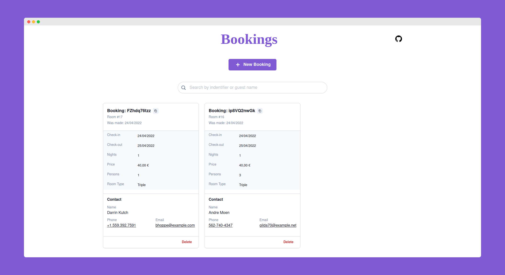

<div align="center" >
    
</div>

Live [demo](https://reserve-searcher.herokuapp.com/) 🚀

## Packages

Some of the important packages used on this project:

| Package                                          | Version |
| ------------------------------------------------ | ------- |
| [Laravel](https://laravel.com/)                  | 8.x     |
| [React](https://reactjs.org/)                    | 18.x    |
| [Inertiajs](https://inertiajs.com/)              | 0.11.x  |
| [chakra-ui](https://chakra-ui.com/)              | 1.8.x   |
| [react-hook-form](https://react-hook-form.com/)  | 7.30.x  |
| [react-table](https://react-table.tanstack.com/) | 7.7.x   |

## Installation

Clone the repo locally:

```sh
git clone https://github.com/smartcrash/reserve-searcher.git
cd reserve-searcher
```

Install PHP dependencies:

```sh
composer install
```

Install NPM dependencies:

```sh
npm install
```

Build assets:

```sh
npm run dev
```

Setup configuration:

```sh
cp .env.example .env
```

Generate application key:

```sh
php artisan key:generate
```

Run database migrations and seeder:

```sh
php artisan migrate --seed
```

Run artisan server:

```sh
php artisan serve
```

You're ready to go! Visit (http://127.0.0.1:8000/) in your browser, and start playing around.

## Running tests

To run the tests, run

```
php artisan dusk
```
